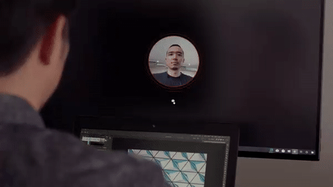

# Sehyun Av Kim

Technical Artist & Prototyper. My focus has been on real time computer graphics, mainly but not limited to realtime AR/VR applications

[Resume](https://docs.google.com/document/d/1U_0qwoadvwsV9x-FkS7Bj1ODvtJ5vnsinRwrHzDMlVI/edit?usp=sharing)

---

# @Apple

*technical artist* from 2022 Jan to present  
*contracted creative technologist* from 2021 Jun to 2022 Jan  

* Prototyping
* Look development

* <https://quip-apple.com/aAkjAZE14FJL>

---

# @Spatial

Technical Artist/Prototyper from 2018 - 2021
[https://spatial.io](https://spatial.io/)

**What I did**  
Design and implement realtime VFX, animations for interactions and user interface in various platforms such as Microsoft Hololens, Oculus Quest, iOS/Android devices, and Web browser with Unity and Threejs.

---

 
## 3D Object Transition Effects

### What

A transition effects for 3d objects res-in/out. GPU driven particle system. Developed in Unity3D

### How it works

1. Batched triangles(particles) are generated based on the given target meshes triangles
2. Transform of the triangles are computed in compute shader, encoded to a compute buffer
3. Computed transform data is applied in vertex shader pass
4. Lighting is applied in fragment shader pass:
    1. Target meshes vertex attributes are encoded into ** this compute buffer as well and used for looking up target meshes rendering parameters to match up the initial look when the transition begins

* Oculus Quest1, 2,  iOS/Android devices

### Iterations

   

---

## Clapping Effects

  

## Runtime Avatar Setup on Web Browser

  

*What it is?*
Runtime avatar generation and configuration with WebGL(Threejs) viewer

*How it works?*

1. Avatar Generation SDK produces a head mesh with a set of blend shape targets by a picture you upload
2. The head mesh is assembled with a pre-rigged generic body mesh
3. The head mesh is rigged in runtime based on a pre-defined weight map (Every produced head meshes share the same uv layout)
4. A pre-animated generic model is showing while the above processes are completed in background, and swap with the completed avatar with it once the processes are done

*Target Platforms*

* Web browsers

*Design Prototype (prerendered animations)*  
  

## Runtime Scribble Mesh

  

*What it is?*
A runtime strip mesh generation for scribbling in immersive environment

*Notes*

* A flat strip mesh is used for a better performance for hololens
* Surface direction is defined by direction delta between current and previous input in order to prevent scribble meshes being too flat on certain angle

*Target Platforms*

* Oculus Quest 1,2, Hololens 1,2

## Configurable Button & Tangible Touch Interaction

   

*What it is?*
A configurable button module with tangible interaction

*Target Platforms*

* Oculus Quest 1,2,  Hololens 1,2

## Selfie Stick (Screen Capture Module)

 
*What it is?*
A screen capture module in a selfie stick form, providing a playful experience yet serving the purpose

*Target Platforms*

* Oculus Quest 1, 2

## Work Board

 
 

## Gaze Hint

 

## Object Highlighter

 

## 3D Elastic Tooltip

## Space Portal

 
*What it is?*
Prototyping a space portal

* Target space is capture as a cubemap and map to the portal sphere
* The portal sphere is backface rendered to create 3D space portal illusion (3D parallax)

*Target Platforms*

* Oculus Quest1, 2

## Runtime Lightmap Transition

*What it is?*
Prototyping a simple lightmap transition system to express different time of a day in VR

*Target Platforms*

* Oculus Quest1, 2

# Technical Exploration

## Custom Spring Physics & Confetti Particle System

 
*What it is?*

* A technical exploration in VR with spring physics for sling shot to trigger confetti like particles
* Developed in Unity3D/Oculus Rift

## Fluid Simulation

  -1945.gif)  

*What it is?*

* A technical exploration in particle system based on fluid simulation
* Developed in Cinder with Nvidia Flex library for fluid simulation

## Ray Marching & Metaball

*What it is?*

* A technical exploration in ray marching and metaball
* Implemented based on Inigo Quilez’s metaball (<https://www.shadertoy.com/view/ld2GRz>)
* Extra small particles are actual geometries, they are composed in a composition shader pass with ray marched metaball pass with manual depth testing
* Developed in Unity3D

## Sphere Collision Detection & Screen Space Reflection

  

*What it is?*

* A technical exploration in sphere collision test and screen space reflection
* GPU driven particle system, particle’s transform parameters are computed in compute shader and applied to batched spheres
* Naive brute force collision test in compute shader
* Developed in Unity3D

## Procedural PBR textures & Subsurface Scattering

*What it is?*

* A technical exploration in lookdev with procedurally generated textures for PBR lighting and subsurface scattering
* Roughness map is generated from 2D noise pattern, the roughness map can be considered as an inverted height map by assuming the surface of the sphere is perfectly smooth, a tangent space normal map can be generated from the height map by comparing neighbor’s height
* Developed with Threejs

# Personal Works

.gif)
.gif)
.gif)

## Walk

*What it is?*

* Demo available via avseoul.net/walk (<http://avseoul.net/walk>) (*Currently not working on Safari due to OffScreenCanvas (<https://developer.mozilla.org/en-US/docs/Web/API/OffscreenCanvas>) API that I use in this sketch, not supported in Safari. Tested with Chrome)
* The rendering is based on Threejs PBR lighting but slightly modified since I do deferred shading due to no transparency in the scene and most of the additional rendering techniques that I applied are in screen space. I also do a custom skinned mesh animation that is modified from the Threejs.
* Threejs skinning is done in vertex shader pass of when the skinned mesh is rendered, so the modified vertex position is not accessible from in other passes. So I had to get around by encoding the skinned mesh vertex attributes and skinning attributes to textures, computing the skinning in an extra shader pass, export the skinned position, normal, and tangent to textures.
* So in the vertex shader pass of the skinned mesh only looks up those textures by vertex index, and applies the values to their vertex attributes. This enables me to glitch the model easily. What I did was, just give a little bit of random shuffle and offset to the texture coordinates for sampling skinning textures, so the skinning attributes are applied to the incorrect vertex.
* Particle systems reference those skinned positions and normals as well for their emitting position and forces. (Particle systems are pre-batched cubes and quads driven by textures in shader passes in order to draw them in less draw calls. I use extra texture coordinate channels to store the index of those individual cube and quad in order to distinguish them in the same shader pass)
* Developed with Threejs

Etc.
